### **01_.png - Copyright Screen**
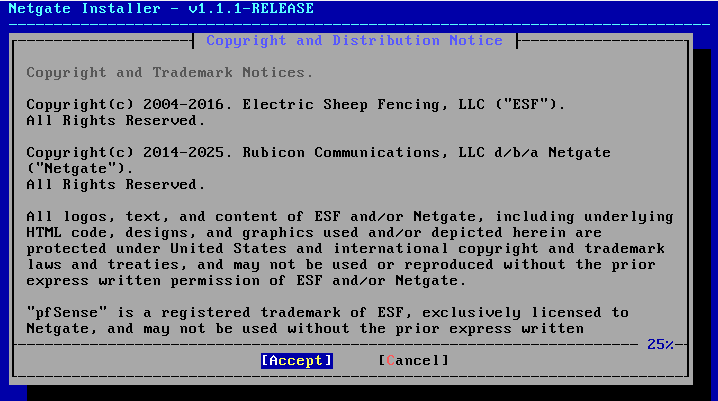

**လုပ်ရမည့်အဆင့်:**
- **"Accept"** ကိုနှိပ်ပါ
- ဒါဟာ license agreement ကိုလက်ခံတာဖြစ်ပါတယ်
- Cancel နှိပ်ရင် installation ရပ်သွားမယ်

---

### **02_.png - Welcome Screen**
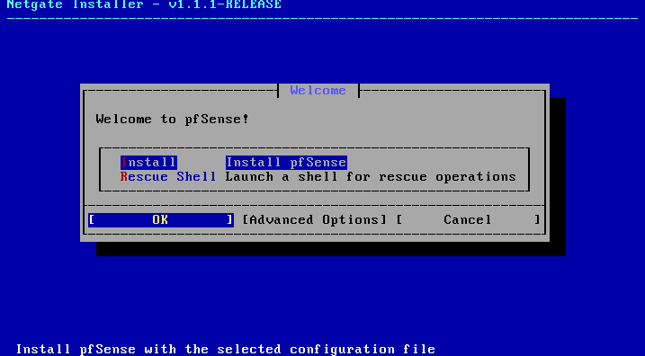

**လုပ်ရမည့်အဆင့်:**
- **"Install"** ကိုနှိပ်ပါ
- Rescue Shell ကိုမလိုပါ
- ပုံမှန် installation ကိုဆက်လုပ်ရန်ဖြစ်သည်

---

### **03_.png - Network Installation**
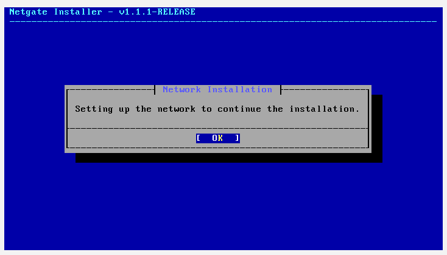

**လုပ်ရမည့်အဆင့်:**
- **"OK"** ကိုနှိပ်ပါ
- ဒါဟာ installation အတွက် network ကိုပြင်ဆင်နေခြင်းဖြစ်သည်
- ခဏစောင့်ပါ

---

### **04_.png - WAN Interface Selection**
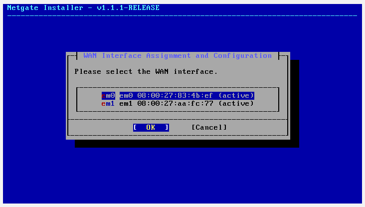

**လုပ်ရမည့်အဆင့်:**
- **em0** ကိုရွေးပါ (အမှန်ခြစ်ပေါ်လာအောင်)
- **"OK"** ကိုနှိပ်ပါ
- em0 က WAN (အပြင်ကို ချိတ်ဆက်မည့်) interface ဖြစ်သည်

---

### **05_.png - WAN Configuration**
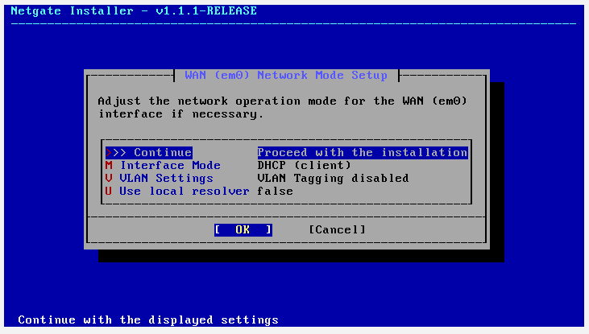

**လုပ်ရမည့်အဆင့်:**
- **"OK"** ကိုနှိပ်ပါ
- Interface Mode: **DHCP** အတိုင်းထားပါ
- ဒါဟာ WAN ကို DHCP ကနေ IP လာတောင်းခိုင်းခြင်းဖြစ်သည်

---

### **06_.png - LAN Interface Selection**
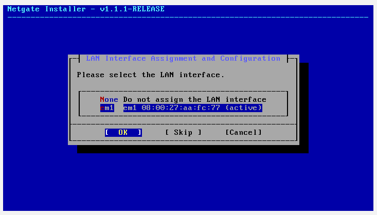

**လုပ်ရမည့်အဆင့်:**
- **em1** ကိုရွေးပါ ("None" ကိုမရွေးပါနှင့်!)
- **"OK"** ကိုနှိပ်ပါ
- em1 က LAN (အတွင်းကို ချိတ်ဆက်မည့်) interface ဖြစ်သည်

---

### **07_.png - LAN Configuration**
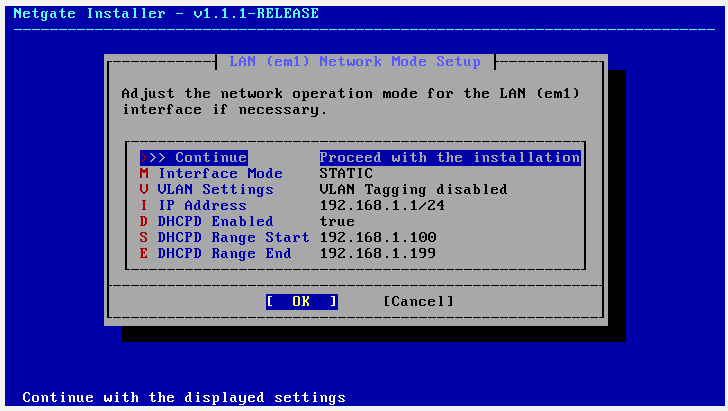

**လုပ်ရမည့်အဆင့်:**
- **"OK"** ကိုနှိပ်ပါ
- IP Address: **192.168.1.1/24** အတိုင်းထားပါ
- DHCP ကိုဖွင့်ထားပါ

---

### **08_.png - LAN IP Address Change**
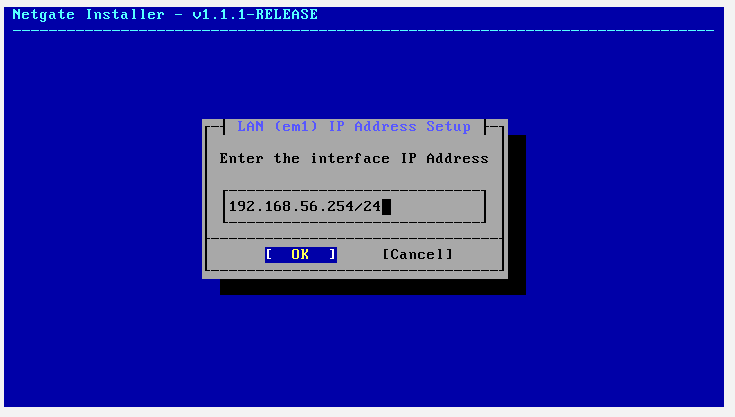

**လုပ်ရမည့်အဆင့်:**
- **"OK"** ကိုနှိပ်ပါ
- IP ကို **192.168.56.254/24** ပြောင်းထားသည်
- VirtualBox internal network အတွက်ပိုသင့်တော်သည်

---

### **09_.png - DHCP Range Start**
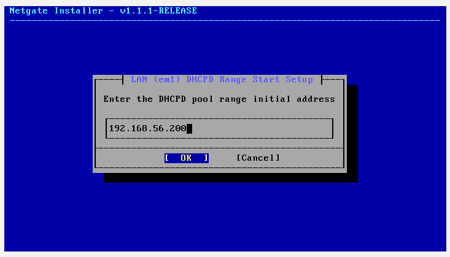

**လုပ်ရမည့်အဆင့်:**
- **"OK"** ကိုနှိပ်ပါ
- DHCP စမည့် IP: **192.168.56.200**

---

### **10_.png - Final LAN Configuration**
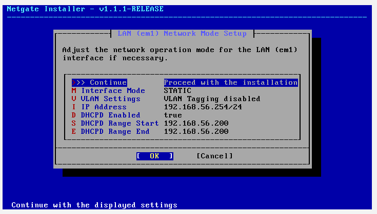

**လုပ်ရမည့်အဆင့်:**
- **"OK"** ကိုနှိပ်ပါ
- ဒါဟာ LAN configuration ကို confirm လုပ်ခြင်းဖြစ်သည်

---

### **11.png - Interface Assignment Confirmation**

**လုပ်ရမည့်အဆင့်:**
- **"Continue"** ကိုနှိပ်ပါ
- WAN: em0, LAN: em1 ဖြစ်ကြောင်း confirm လုပ်ပါ

---

### **12_.png - Connectivity Check**
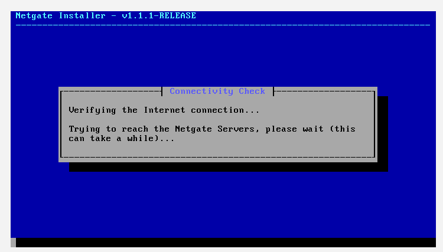

**လုပ်ရမည့်အဆင့်:**
- စောင့်ပါ... Internet connection စစ်နေသည်
- မိနစ်အနည်းငယ်ကြာနိုင်သည်

---

### **13_.png - Subscription Validation**
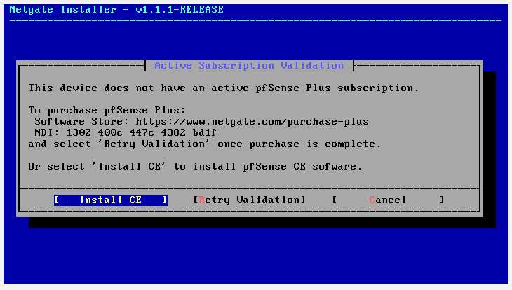

**လုပ်ရမည့်အဆင့်:**
- **"Install CE"** ကိုနှိပ်ပါ
- Community Edition (အခမဲ့) ကိုတပ်ဆင်ရန်ဖြစ်သည်

---

### **14_.png - Installation Options**
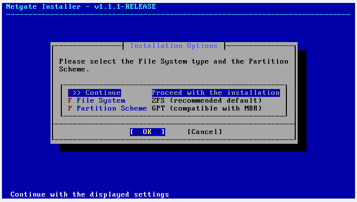

**လုပ်ရမည့်အဆင့်:**
- **"OK"** ကိုနှိပ်ပါ
- ZFS file system နဲ့ GPT partition scheme အတိုင်းထားပါ

---

### **15_.png - ZFS Configuration**
**လုပ်ရမည့်အဆင့်:**
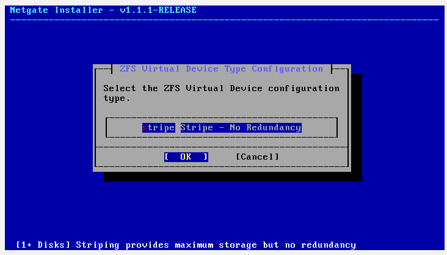

- **"Stripe"** ကိုရွေးပြီး **"OK"** နှိပ်ပါ
- VM တစ်ခုတည်းအတွက် stripe က လုံလောက်သည်

---

### **16_.png - Disk Selection**
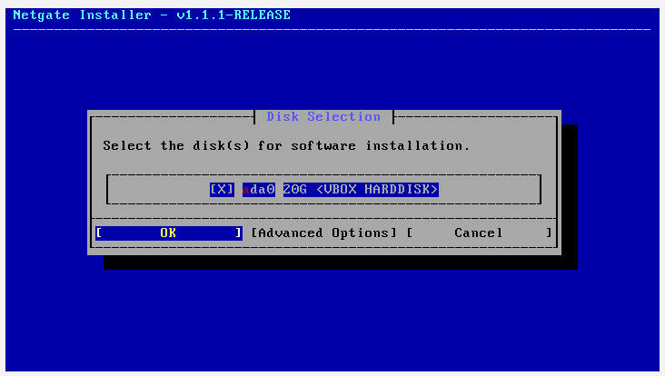

**လုပ်ရမည့်အဆင့်:**
- **"OK"** ကိုနှိပ်ပါ
- ada0 disk ကိုရွေးပါ

---

### **17_.png - Confirmation**
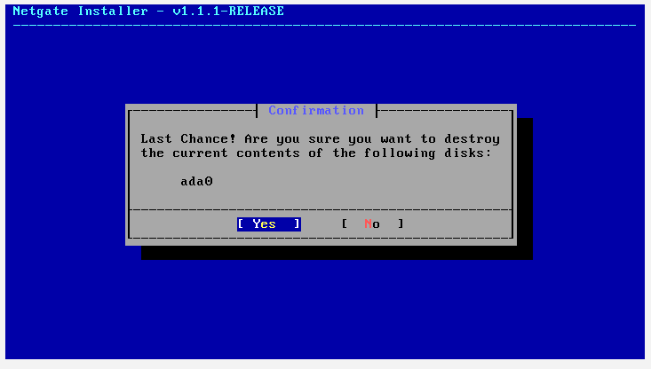

**လုပ်ရမည့်အဆင့်:**
- **"Yes"** ကိုနှိပ်ပါ
- Disk ပေါ်ကအရာအားလုံးဖျက်မည်ကို confirm လုပ်ပါ

---

### **18_.png - Partitioning**
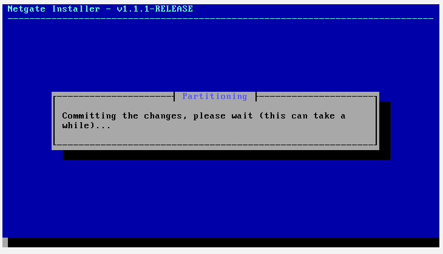

**လုပ်ရမည့်အဆင့်:**
- စောင့်ပါ... partitioning လုပ်နေသည်

---

### **19_.png - Software Version**
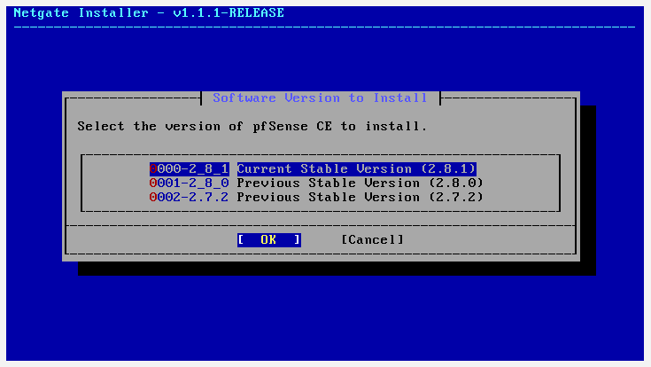

**လုပ်ရမည့်အဆင့်:**
- **"OK"** ကိုနှိပ်ပါ
- **2.8.1 Current Stable Version** ကိုရွေးပါ

---

### **20_.png - Installation Progress**
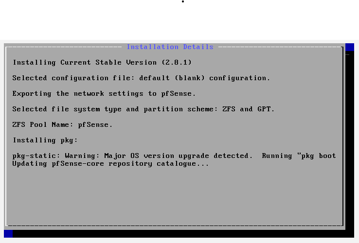

**လုပ်ရမည့်အဆင့်:**
- စောင့်ပါ... pfSense တပ်ဆင်နေသည်
- ပြီးရင် auto reboot ဖြစ်ပါလိမ့်မယ်

---
