### **21_.png - VirtualBox Settings**

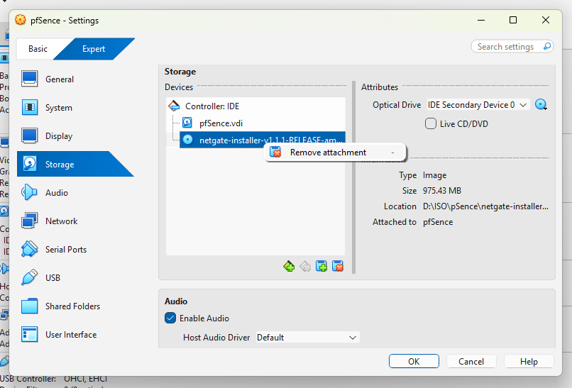

**လုပ်ရမည့်အဆင့်:**
- Storage ကဏ္ဍမှာ **"netgate-installer" ISO file** ကို detach လုပ်ပါ
- Optical Drive ဘေးက CD icon ကိုနှိပ်ပြီး **"Remove Disk from Virtual Drive"** ရွေးပါ
- ဒါဆိုရင် VM က hard disk ကနေ boot လုပ်ပါလိမ့်မယ်
---

### **22_.png - Browser Security Warning**
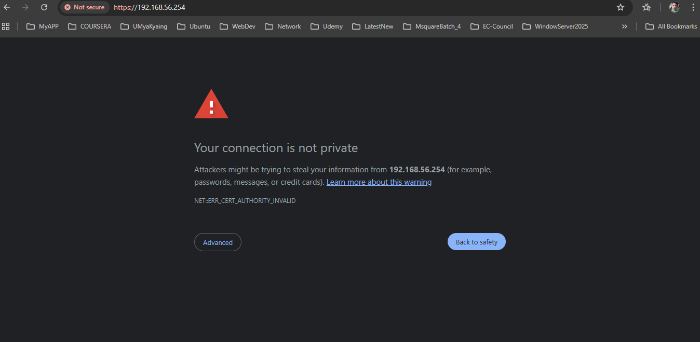

**လုပ်ရမည့်အဆင့်:**
- **"Advanced"** ကိုနှိပ်ပါ
- **"Proceed to 192.168.56.254 (unsafe)"** ကိုနှိပ်ပါ
- Self-signed certificate အတွက် warning ဖြစ်တာကြောင့် ဆက်သွားလို့ရပါတယ်

---

### **23_.png - pfSense Login Page**
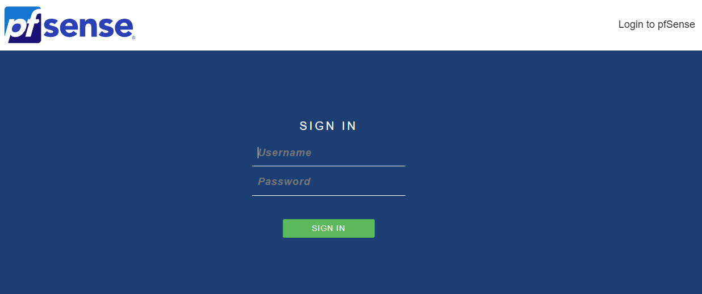

**လုပ်ရမည့်အဆင့်:**
- **Username:** `admin`
- **Password:** `pfsense`
- **"SIGN IN"** ကိုနှိပ်ပါ

---

### **24_.png - Setup Wizard Welcome**
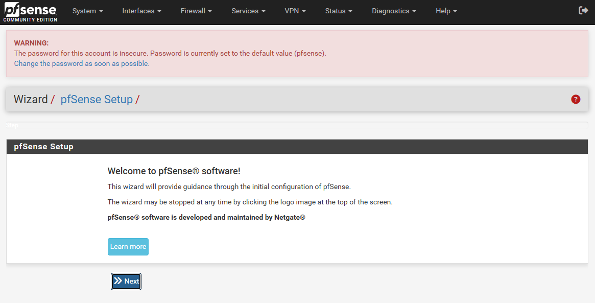

**လုပ်ရမည့်အဆင့်:**
- **"Next"** ကိုနှိပ်ပါ
- Setup wizard ကိုစတင်ရန်ဖြစ်သည်

---

### **25_.png - Netgate Support Info**
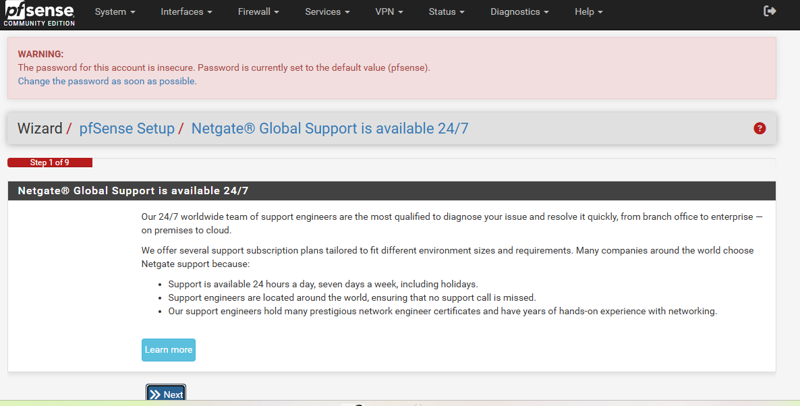

**လုပ်ရမည့်အဆင့်:**
- **"Next"** ကိုနှိပ်ပါ
- Support information ကိုဖတ်ပြီး ဆက်သွားပါ

---

### **26_.png - General Information**
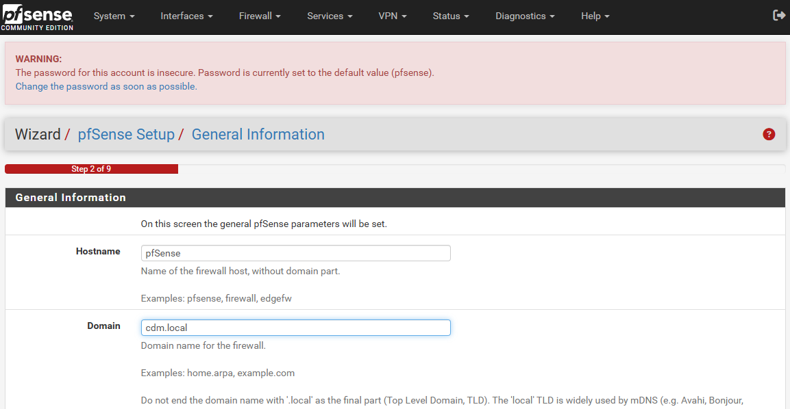

**လုပ်ရမည့်အဆင့်:**
- Hostname ကို `pfsense` အတိုင်းထားပါ
- Domain ကို `cdm.local` အတိုင်းထားပါ
- **"Next"** ကိုနှိပ်ပါ

---

### **27_.png - DNS Configuration**
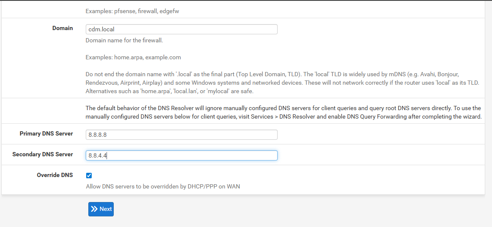

**လုပ်ရမည့်အဆင့်:**
- Primary DNS: `8.8.8.8` (Google DNS)
- Secondary DNS: `8.8.4.4` (Google DNS)
- **"Next"** ကိုနှိပ်ပါ

---

### **28_.png - Time Server Setup**
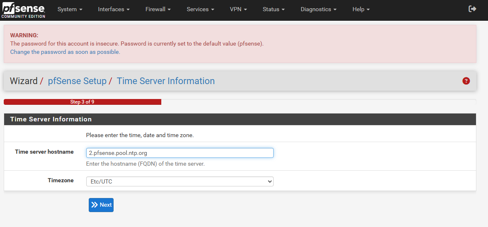

**လုပ်ရမည့်အဆင့်:**
- Time server: `2.pfsense.pool.ntp.org` အတိုင်းထားပါ
- Timezone: `Etc/UTC` အတိုင်းထားပါ
- **"Next"** ကိုနှိပ်ပါ

---

### **29_.png - WAN Interface Configuration**
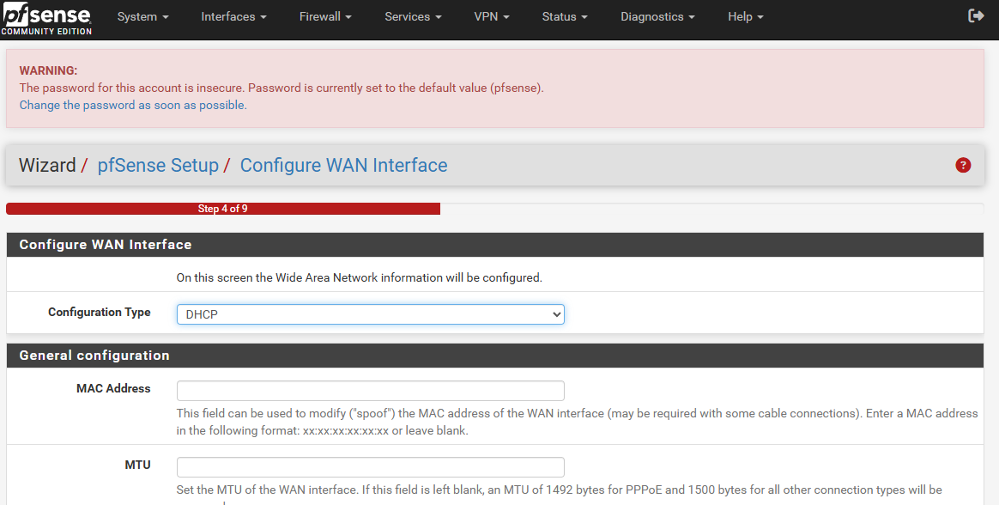

**လုပ်ရမည့်အဆင့်:**
- Configuration Type: **DHCP** အတိုင်းထားပါ
- MAC Address: ဗလာထားပါ
- MTU: ဗလာထားပါ
- **"Next"** ကိုနှိပ်ပါ

---

### **30_.png - LAN Interface Configuration**
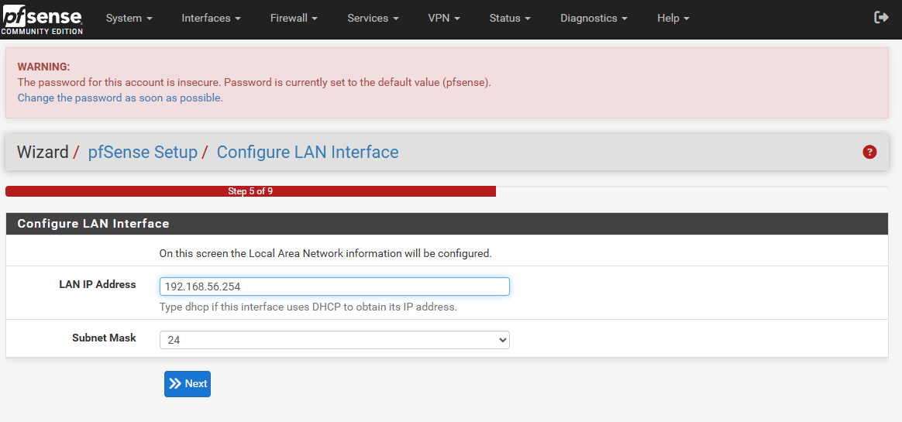

**လုပ်ရမည့်အဆင့်:**
- LAN IP Address: `192.168.56.254` အတိုင်းထားပါ
- Subnet Mask: `24` အတိုင်းထားပါ
- **"Next"** ကိုနှိပ်ပါ

---

### **31_.png - Change Admin Password**
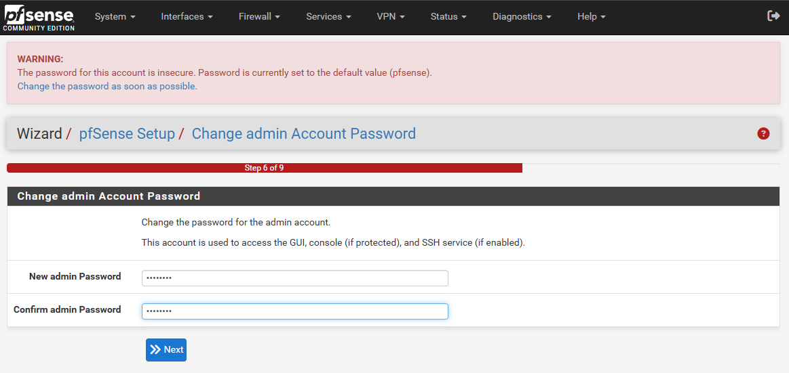

**လုပ်ရမည့်အဆင့်:**
- **New admin Password:** ကိုယ်ပိုင် password ရိုက်ထည့်ပါ
- **Confirm admin Password:** အထက်ကအတိုင်း ထပ်ရိုက်ပါ
- **"Next"** ကိုနှိပ်ပါ
- **အရေးကြီး:** Default password ကိုပြောင်းပါ

---

### **32_.png - Reload Configuration**
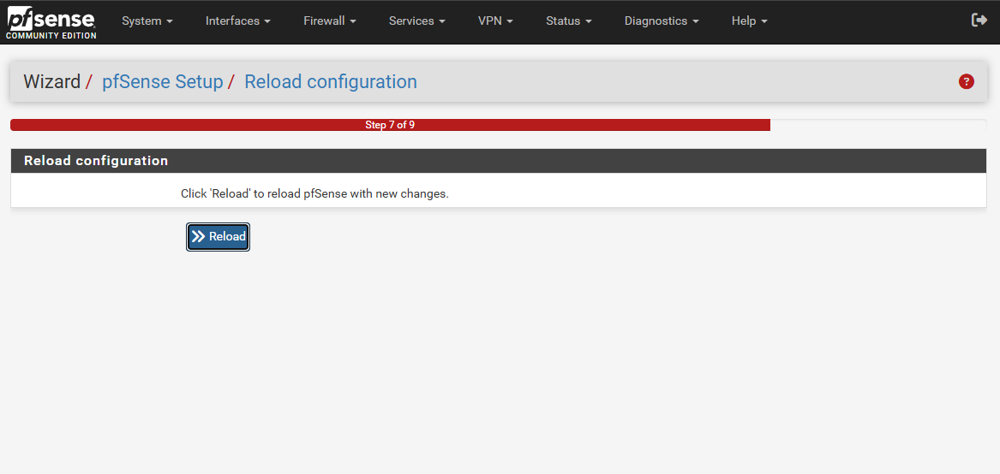

**လုပ်ရမည့်အဆင့်:**
- **"> Reload"** ကိုနှိပ်ပါ
- Configuration အသစ်တွေကို apply လုပ်စေရန်ဖြစ်သည်

---

### **33_.png - Wizard Completed**
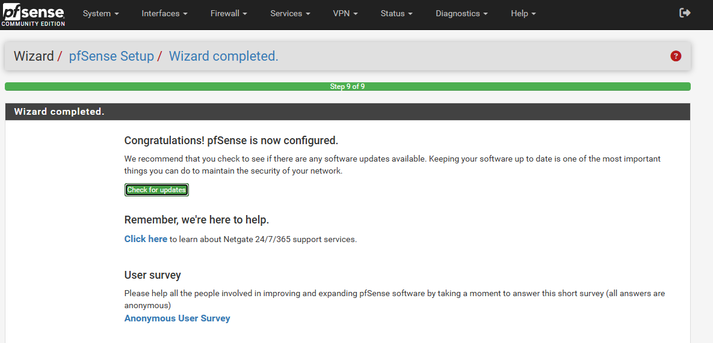

**လုပ်ရမည့်အဆင့်:**
- **"Finish"** သို့မဟုတ် **"Complete"** ကိုနှိပ်ပါ
- Setup wizard ပြီးဆုံးပြီဆိုတဲ့ message ဖြစ်သည်

---

### **34_.png - pfSense Dashboard**
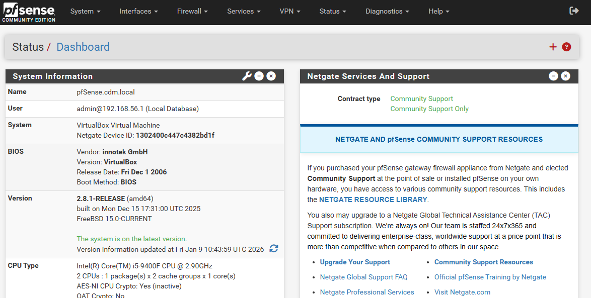

**လုပ်ရမည့်အဆင့်:**
- Dashboard ကိုကြည့်ရှုပါ
- System information များကို စစ်ဆေးပါ
- Interfaces (WAN/LAN) status များကို ကြည့်ပါ